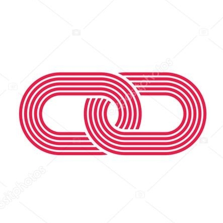

---

# Sistema: ProgramaEdu

## Problemática

Despertar no aluno do ensino médio o interesse pela carreira de programação.


## Solução Proposta

Criar um portal colaborativo que permita a conexão de profissionais da área de tecnologia de informação com alunos do ensino médio que demonstrem algum interesse pela área. 

## Premissas

- Alunos do ensino médio que demonstrem algum interesse pela área.

## Fluxo de Ações

#### 1) Aluno cria dúvida no sistema
- Aluno acessa a plataforma e pode enviar dúvidas em forma de problemas dentro das categorias presentes.

#### 2) Programador acessar o portal com dúvidas pendentes
- Programador acessa a plataforma e  

#### 3) Programador responde a pergunta
- O programador responde ao problema através de um código fonte em alguma linguagem de programação e envia como responda para o aluno.
- O programador pode utilizar de outros recursos para como envio de links para auxiliar no entendimento.

#### 4) Aluno visualiza pergunta respondida
- O aluno recebe uma notificação por e-mail e pode acessar o sistema para verificar a resposta recebida.

### 5) Aluno replica o problema
- Caso julgue necessário, ele poderá enviar novos questionamentos sobre o problema.

#### 6) Aluno fecha o problema
- Após sanadas as dúvidas sobre o problema, o aluno fecha o item no sistema.


<br>

```mermaid
sequenceDiagram
    ALUNO->>+SISTEMA: Criar Problema
    SISTEMA->>+PROGRAMADOR: Selecionar Problema
    PROGRAMADOR->>-SISTEMA: Responder Problema
    ALUNO-->>-SISTEMA: Replicar Problema
    ALUNO->>+SISTEMA: Fechar Problema

```

## Telas do Sistema

### Tela do Programador

<br>
<br>

### Tela do Aluno

<br>
<br>
